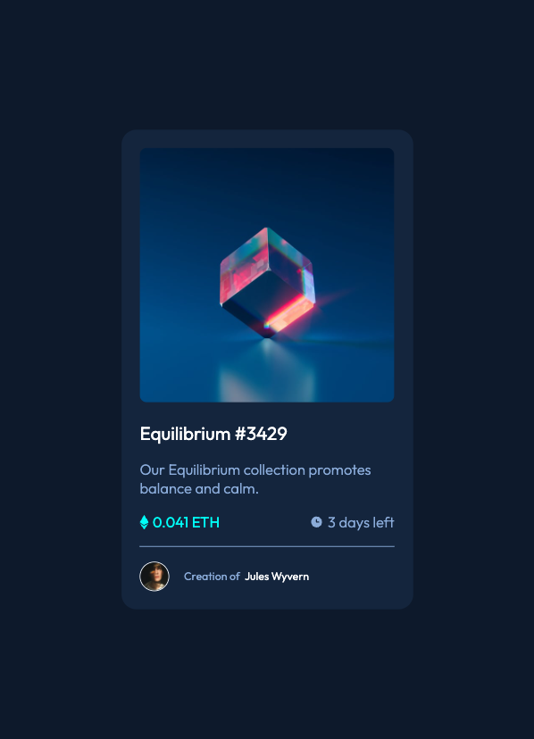

# Frontend Mentor - NFT preview card component


## Welcome! 👋# Frontend Mentor - NFT preview card component solution

This is a solution to the [NFT preview card component challenge on Frontend Mentor](https://www.frontendmentor.io/challenges/nft-preview-card-component-SbdUL_w0U).

## Table of contents

- [Frontend Mentor - NFT preview card component](#frontend-mentor---nft-preview-card-component)
  - [Welcome! 👋# Frontend Mentor - NFT preview card component solution](#welcome--frontend-mentor---nft-preview-card-component-solution)
  - [Table of contents](#table-of-contents)
  - [Overview](#overview)
    - [The challenge](#the-challenge)
    - [Screenshot](#screenshot)
    - [Links](#links)
  - [My process](#my-process)
    - [Built with](#built-with)
  - [Author](#author)

## Overview

### The challenge

Users should be able to:

- View the optimal layout depending on their device's screen size
- See hover states for interactive elements

### Screenshot



### Links

- Solution URL: [https://github.com/wongstephen/frontend-nft-card](https://github.com/wongstephen/frontend-nft-card)
- Live Site URL: [https://nft-card-sw.netlify.app/](https://nft-card-sw.netlify.app/)

## My process

To create a NFT card component using semantic HTML and CSS styling, I started by creating the HTML structure of the card using semantic elements such as ``nd <main>``. Then, I used CSS to style the card's layout, background color, font family, and text styles.

Next, I added an image of the NFT to the card using the ```` tag and styled it with CSS. I used the styling guide to approximate dimensions and spacing.

Overall, creating this NFT card component using semantic HTML and CSS styling was a fun and straightforward process.
### Built with

- Semantic HTML5 markup
- CSS custom properties
- Flexbox
- Mobile-first workflow

## Author

- Website - [Stephen Wong](https://www.wongstephenk.com)

